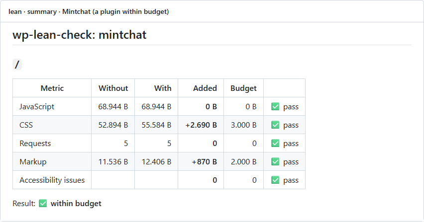
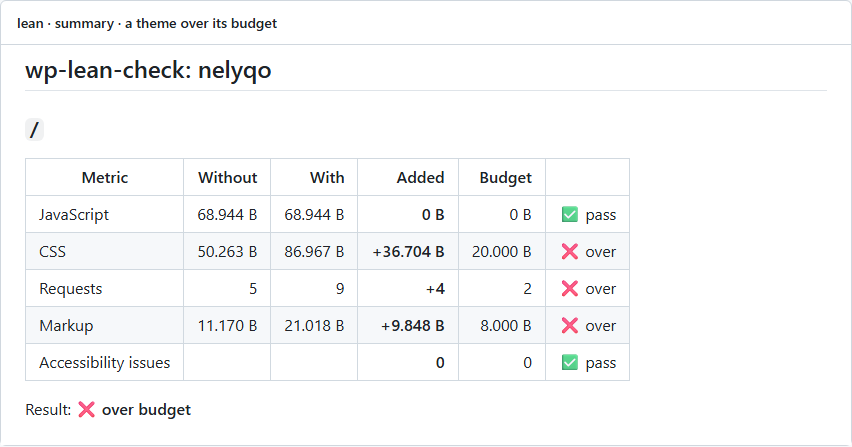

# wp-lean-check

[](https://github.com/massimomazzariol/wp-lean-check/actions/workflows/ci.yml)
[](https://github.com/massimomazzariol/wp-lean-check/releases/latest)
[](#github-actions)
[](https://wordpress.org/playground/)
[](https://github.com/dequelabs/axe-core)
[](LICENSE)

**What does your WordPress plugin or theme add to a page, and does it add accessibility issues?**

wp-lean-check loads each page of a demo site twice, **with and without** your plugin or theme, and tells you the difference: JavaScript, CSS, requests, markup and WCAG 2.2 AA issues. Set a budget and your CI fails the day a change makes the page heavier or less accessible.



## Why

Plugin Check tells you whether your code follows the rules. It does not tell you what your users pay for it on every page view. That number is what makes a site slow, and it creeps up one release at a time.

- **Net weight, not page weight.** The site's own scripts and styles are measured too, then subtracted: only what you add is left.
- **Accessibility issues you introduce.** axe-core runs on desktop and mobile, with and without you. Issues WordPress itself already causes are not blamed on you.
- **No Docker, no local WordPress.** Everything runs in [WordPress Playground](https://wordpress.org/playground/), in your CI or on your laptop, in about a minute.
- **A budget, not a score.** You decide the limits. The job fails only when you go over them.

## GitHub Actions

Add `lean.json` to your plugin or theme (see below), then:

```yaml
- uses: actions/checkout@v4
- uses: massimomazzariol/wp-lean-check@v0
```

The table lands in the job summary. When a limit is exceeded, the job fails and the report says where:



## lean.json

```json
{
	"type": "plugin",
	"slug": "my-plugin",
	"blueprint": "lean/blueprint.json",
	"pages": [ "/" ],
	"budget": { "js": 0, "css": 3000, "requests": 0, "html": 2000, "a11y": 0 }
}
```

| Key | Meaning |
| --- | --- |
| `type` | `plugin` or `theme` |
| `slug` | The folder name of your plugin or theme |
| `blueprint` | Optional. A [Playground blueprint](https://wordpress.github.io/wordpress-playground/blueprints/) that builds the demo content, for example a page that uses your block. Your plugin or theme is already mounted and active when it runs. |
| `pages` | Paths to measure |
| `budget` | The most each metric may grow, per page: bytes for `js`, `css` and `html`, a count for `requests` and `a11y`. Leave a key out for no limit. |

[Mintchat's lean.json](https://github.com/massimomazzariol/mintchat/blob/main/lean.json) and [its blueprint](https://github.com/massimomazzariol/mintchat/blob/main/lean/blueprint.json) are a complete example.

## Run it locally

Node.js 20 or later:

```sh
git clone https://github.com/massimomazzariol/wp-lean-check
cd wp-lean-check && npm install && npx playwright install chromium
node cli.js --dir ../my-plugin
```

Exit code `0` within budget, `1` over budget, `2` for a configuration error.

## How it measures

| Metric | What counts |
| --- | --- |
| JavaScript | External scripts plus inline `<script>` code |
| CSS | External stylesheets plus inline `<style>` code |
| Requests | Every request after the HTML document |
| Markup | The HTML document without its inline scripts and styles, so nothing is counted twice |
| Accessibility issues | axe-core violations tagged WCAG 2.0, 2.1 and 2.2 A/AA, desktop (1280 × 800) and mobile (390 × 844), compared by count per rule |

Sizes are uncompressed bytes as the browser receives them. Numbers use the European format: `68.944 B` is sixty-eight thousand bytes.

**Without** means the plugin deactivated for that request only, through a small must-use plugin that exists only inside the throwaway Playground site. For a theme, it means Twenty Twenty-Five on the same content: block styles of content that only your theme can render (its patterns, its blocks) count as added.

## What it does not do

- WordPress.org rules and coding standards: run the official [Plugin Check action](https://github.com/WordPress/plugin-check-action) next to it.
- Server time and Core Web Vitals: see [wp-performance-action](https://github.com/swissspidy/wp-performance-action).
- A full accessibility audit: automated tools find part of the problems. Keyboard and screen reader checks are still on you.

## License

GPL-2.0-or-later.
